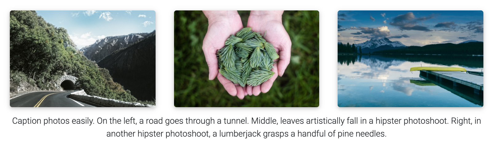

## Installing

For installation details please refer to [INSTALL.md](INSTALL.md).
For local development, see the "Local dev helper" section there.

## Customizing

For customization details please refer to [CUSTOMIZE.md](CUSTOMIZE.md).

## Features

#### Photos, Audio, Video and more

Photo formatting is made simple using [Bootstrap's grid system](https://getbootstrap.com/docs/4.4/layout/grid/). Easily create beautiful grids within your blog posts and project pages, also with support for [video](https://alshedivat.github.io/al-folio/blog/2023/videos/) and [audio](https://alshedivat.github.io/al-folio/blog/2023/audios/) embeds:

  

---

### Other features

#### Social media previews

**al-folio** supports preview images on social media. To enable this functionality you will need to set `serve_og_meta` to `true` in your [\_config.yml](_config.yml). Once you have done so, all your site's pages will include Open Graph data in the HTML head element.

You will then need to configure what image to display in your site's social media previews. This can be configured on a per-page basis, by setting the `og_image` page variable. If for an individual page this variable is not set, then the theme will fall back to a site-wide `og_image` variable, configurable in your [\_config.yml](_config.yml). In both the page-specific and site-wide cases, the `og_image` variable needs to hold the URL for the image you wish to display in social media previews.

---

#### Atom (RSS-like) Feed

It generates an Atom (RSS-like) feed of your posts, useful for Atom and RSS readers. The feed is reachable simply by typing after your homepage `/feed.xml`. E.g. assuming your website mountpoint is the main folder, you can type `yourusername.github.io/feed.xml`

---

#### Related posts

By default, there will be a related posts section on the bottom of the blog posts. These are generated by selecting the `max_related` most recent posts that share at least `min_common_tags` tags with the current post. If you do not want to display related posts on a specific post, simply add `related_posts: false` to the front matter of the post. If you want to disable it for all posts, simply set `enabled` to false in the `related_blog_posts` section in [\_config.yml](_config.yml).

---

## License

The theme is available as open source under the terms of the [MIT License](https://github.com/alshedivat/al-folio/blob/master/LICENSE).

Originally, **al-folio** was based on the [\*folio theme](https://github.com/bogoli/-folio) (published by [Lia Bogoev](https://liabogoev.com) and under the MIT license). Since then, it got a full re-write of the styles and many additional cool features.
